# MeshCore GUI — BLE Architecture

## Overzicht

Dit document beschrijft hoe MeshCore GUI communiceert met een MeshCore T1000-E device via Bluetooth Low Energy (BLE), welke libraries daarbij betrokken zijn, en hoe de volledige stack van hardware tot applicatielogica in elkaar zit.

---

## 1. De BLE Stack

De communicatie loopt door 7 lagen, van hardware tot GUI:

```
┌─────────────────────────────────────────────────────┐
│  7. meshcore_gui          (applicatie)               │
│     BLEWorker, EventHandler, CommandHandler          │
├─────────────────────────────────────────────────────┤
│  6. meshcore (meshcore_py)  (protocol)               │
│     MeshCore.connect(), commands.*, event callbacks   │
├─────────────────────────────────────────────────────┤
│  5. bleak                   (BLE abstractie)         │
│     BleakClient.connect(), start_notify(), write()   │
├─────────────────────────────────────────────────────┤
│  4. dbus_fast               (D-Bus async client)     │
│     MessageBus, ServiceInterface, method calls       │
├─────────────────────────────────────────────────────┤
│  3. D-Bus system bus        (IPC)                    │
│     /org/bluez/hci0, org.bluez.Device1, Agent1       │
├─────────────────────────────────────────────────────┤
│  2. BlueZ (bluetoothd)      (Bluetooth daemon)       │
│     GATT, pairing, bonding, device management        │
├─────────────────────────────────────────────────────┤
│  1. Linux Kernel + Hardware  (HCI driver + radio)    │
│     hci0, Bluetooth 5.0 chip (RPi5 built-in / USB)  │
└─────────────────────────────────────────────────────┘
```

---

## 2. Libraries en hun rol

### 2.1 bleak (Bluetooth Low Energy platform Agnostic Klient)

**Doel:** Cross-platform Python BLE library. Abstracteert de platform-specifieke BLE backends achter één API.

| Platform | Backend | Communicatie |
|----------|---------|-------------|
| Linux | BlueZ via D-Bus | `dbus_fast` → `bluetoothd` |
| macOS | CoreBluetooth | Objective-C bridge via `pyobjc` |
| Windows | WinRT | Windows Runtime BLE API |

**Hoe bleak werkt op Linux:**

Bleak praat *niet* rechtstreeks met de Bluetooth hardware. In plaats daarvan stuurt bleak D-Bus berichten naar de BlueZ daemon (`bluetoothd`), die op zijn beurt de kernel HCI driver aanstuurt. Elk bleak-commando wordt vertaald naar een D-Bus method call:

| bleak API | D-Bus call naar BlueZ |
|-----------|----------------------|
| `BleakClient.connect()` | `org.bluez.Device1.Connect()` |
| `BleakClient.disconnect()` | `org.bluez.Device1.Disconnect()` |
| `BleakClient.start_notify(uuid, callback)` | `org.bluez.GattCharacteristic1.StartNotify()` |
| `BleakClient.write_gatt_char(uuid, data)` | `org.bluez.GattCharacteristic1.WriteValue()` |
| `BleakScanner.discover()` | `org.bluez.Adapter1.StartDiscovery()` |

Bleak installeert automatisch `dbus_fast` als dependency.

### 2.2 dbus_fast

**Doel:** Async Python D-Bus library. Biedt twee functies:

1. **Client** — Bleak gebruikt `dbus_fast.aio.MessageBus` om D-Bus method calls naar BlueZ te sturen (connect, read, write, notify). Dit is intern aan bleak; onze code raakt dit niet direct aan.

2. **Server** — Onze `ble_agent.py` gebruikt `dbus_fast.service.ServiceInterface` om een D-Bus service te *exporteren*: de PIN agent die BlueZ aanroept wanneer het device pairing nodig heeft.

Doordat `dbus_fast` al een dependency van `bleak` is, hoeven we geen extra packages te installeren.

### 2.3 meshcore (meshcore_py)

**Doel:** MeshCore protocol implementatie. Vertaalt hoge-niveau commando's naar BLE GATT read/write operaties.

**GATT Service:** MeshCore devices gebruiken de **Nordic UART Service (NUS)** voor communicatie:

| Characteristic | UUID | Richting | Functie |
|---------------|------|----------|---------|
| RX | `6e400002-b5a3-f393-e0a9-e50e24dcca9e` | Host → Device | Commando's schrijven |
| TX | `6e400003-b5a3-f393-e0a9-e50e24dcca9e` | Device → Host | Responses/events ontvangen (notify) |

**Protocol:** De meshcore library:
- Serialiseert commando's (appstart, device_query, get_contacts, send_msg, etc.) naar binaire packets
- Schrijft deze naar de NUS RX characteristic via `bleak.write_gatt_char()`
- Luistert op de NUS TX characteristic via `bleak.start_notify()` voor responses en async events
- Deserialiseert binaire responses terug naar Python dicts met event types

**Communicatiepatroon:** Request-response met async events:

```
meshcore_gui  →  meshcore  →  bleak  →  D-Bus  →  BlueZ  →  HCI  →  Radio  →  T1000-E
                                                                                    │
meshcore_gui  ←  meshcore  ←  bleak  ←  D-Bus  ←  BlueZ  ←  HCI  ←  Radio  ←──────┘
```

Commando's zijn *subscribe-before-send*: meshcore registreert eerst een notify handler op de TX characteristic, stuurt dan het commando via de RX characteristic, en wacht op de response via de notify callback. Dit voorkomt race conditions waarbij de response arriveert voordat de listener klaar is (gefixt in meshcore_py PR #52).

### 2.4 meshcoredecoder

**Doel:** Decodering van ruwe LoRa packets die via de RX log binnenkomen. Decrypts packets met channel keys en extraheert route-informatie (path hashes, hop data). Gebruikt door `PacketDecoder` in de BLE events layer.

### 2.5 Onze eigen BLE modules

| Module | Library | Functie |
|--------|---------|---------|
| `ble_agent.py` | `dbus_fast` (server) | Exporteert `org.bluez.Agent1` interface op D-Bus; beantwoordt PIN requests |
| `ble_reconnect.py` | `dbus_fast` (client) | `remove_bond()`: roept `org.bluez.Adapter1.RemoveDevice()` aan via D-Bus |
| `worker.py` | `meshcore` + `bleak` (indirect) | `MeshCore.connect()`, command loop, disconnect detection |
| `commands.py` | `meshcore` | `mc.commands.send_msg()`, `send_advert()`, etc. |
| `events.py` | `meshcore` | Callbacks: `CHANNEL_MSG_RECV`, `RX_LOG_DATA`, etc. |

---

## 3. De drie D-Bus gesprekken

Onze applicatie voert drie soorten D-Bus communicatie uit, elk met een ander doel:

### 3.1 PIN Agent (dbus_fast — server mode)

**Probleem:** Wanneer BlueZ een BLE device wil pairen dat een PIN vereist, zoekt het op de D-Bus naar een geregistreerde Agent die de PIN kan leveren. Zonder agent faalt de pairing met "failed to discover services".

**Oplossing:** `ble_agent.py` exporteert een `org.bluez.Agent1` service op D-Bus path `/meshcore/ble_agent`. BlueZ roept methodes aan op onze agent:

```
BlueZ (bluetoothd)                    Onze Agent (ble_agent.py)
       │                                        │
       │── RegisterAgent(/meshcore/ble_agent) ──→│  (bij startup)
       │← OK ──────────────────────────────────│
       │                                        │
       │── RequestDefaultAgent() ──────────────→│
       │← OK ──────────────────────────────────│
       │                                        │
       │    ... device wil pairen ...           │
       │                                        │
       │── RequestPinCode(/org/bluez/.../dev) ─→│
       │← "123456" ───────────────────────────│
       │                                        │
       │    ... pairing succesvol ...           │
```

### 3.2 Bond Cleanup (dbus_fast — client mode)

**Probleem:** Na een disconnect slaat BlueZ de pairing keys op (een "bond"). Bij reconnectie gebruikt BlueZ deze oude keys, maar het device heeft ze verworpen → "PIN or Key Missing" error.

**Oplossing:** `ble_reconnect.py` stuurt een D-Bus method call naar BlueZ:

```python
# Equivalent van: bluetoothctl remove FF:05:D6:71:83:8D
bus.call(
    destination="org.bluez",
    path="/org/bluez/hci0",            # Adapter
    interface="org.bluez.Adapter1",
    member="RemoveDevice",
    signature="o",
    body=["/org/bluez/hci0/dev_FF_05_D6_71_83_8D"]  # Device object path
)
```

### 3.3 BLE Communicatie (bleak → dbus_fast — client mode)

Bleak stuurt intern D-Bus berichten voor alle BLE operaties. Dit is transparant voor onze code — wij roepen alleen de bleak API aan, bleak vertaalt naar D-Bus:

```python
# Onze code (via meshcore):
await mc.connect(ble_address)

# Wat bleak intern doet:
await bus.call("org.bluez.Device1.Connect()")
await bus.call("org.bluez.GattCharacteristic1.StartNotify()")  # TX char
await bus.call("org.bluez.GattCharacteristic1.WriteValue()")   # RX char
```

---

## 4. Sequence Diagram — Volledige BLE Lifecycle

Het onderstaande diagram toont de complete levenscyclus van een BLE sessie, van startup tot disconnect en reconnect.

```mermaid
sequenceDiagram
    autonumber
    participant GUI as GUI Thread<br/>(NiceGUI)
    participant Worker as BLEWorker<br/>(asyncio thread)
    participant Agent as BleAgentManager<br/>(ble_agent.py)
    participant Reconnect as ble_reconnect.py
    participant MC as meshcore<br/>(MeshCore)
    participant Bleak as bleak<br/>(BleakClient)
    participant DBus as D-Bus<br/>(system bus)
    participant BZ as BlueZ<br/>(bluetoothd)
    participant Dev as T1000-E<br/>(BLE device)

    Note over Worker,Dev: ═══ FASE 1: PIN Agent Registratie ═══

    Worker->>Agent: start(pin="123456")
    Agent->>DBus: connect to system bus
    Agent->>DBus: export /meshcore/ble_agent<br/>(org.bluez.Agent1)
    Agent->>DBus: RegisterAgent(/meshcore/ble_agent, "KeyboardOnly")
    DBus->>BZ: RegisterAgent
    BZ-->>DBus: OK
    Agent->>DBus: RequestDefaultAgent(/meshcore/ble_agent)
    DBus->>BZ: RequestDefaultAgent
    BZ-->>DBus: OK
    Agent-->>Worker: Agent ready

    Note over Worker,Dev: ═══ FASE 2: Bond Cleanup ═══

    Worker->>Reconnect: remove_bond("FF:05:...")
    Reconnect->>DBus: Adapter1.RemoveDevice(/org/bluez/hci0/dev_FF_05_...)
    DBus->>BZ: RemoveDevice
    BZ-->>DBus: OK (of "Does Not Exist" → genegeerd)
    Reconnect-->>Worker: Bond removed

    Note over Worker,Dev: ═══ FASE 3: Verbinding + GATT Discovery ═══

    Worker->>MC: MeshCore.connect("FF:05:...")
    MC->>Bleak: BleakClient.connect()
    Bleak->>DBus: Device1.Connect()
    DBus->>BZ: Connect
    BZ->>Dev: BLE Connection Request
    Dev-->>BZ: Connection Accepted

    Note over BZ,Dev: Pairing vereist (PIN)

    BZ->>DBus: Agent1.RequestPinCode(device_path)
    DBus->>Agent: RequestPinCode()
    Agent-->>DBus: "123456"
    DBus-->>BZ: PIN
    BZ->>Dev: Pairing met PIN
    Dev-->>BZ: Pairing OK + Encryption active

    BZ->>BZ: GATT Service Discovery
    BZ-->>Bleak: Services resolved (NUS: 6e400001-...)
    Bleak-->>MC: Connected

    MC->>Bleak: start_notify(TX: 6e400003-...)
    Bleak->>DBus: GattCharacteristic1.StartNotify()
    DBus->>BZ: StartNotify
    BZ-->>Bleak: Notifications enabled

    MC->>Bleak: write(RX: 6e400002-..., appstart_cmd)
    Bleak->>DBus: GattCharacteristic1.WriteValue(data)
    DBus->>BZ: WriteValue
    BZ->>Dev: BLE Write (appstart)
    Dev-->>BZ: BLE Notify (response)
    BZ-->>Bleak: Notification callback
    Bleak-->>MC: Event: SELF_INFO
    MC-->>Worker: self_info = {name, pubkey, freq, ...}

    Note over Worker,Dev: ═══ FASE 4: Data Laden ═══

    Worker->>MC: commands.send_device_query()
    MC->>Bleak: write(RX, device_query_cmd)
    Bleak->>DBus: WriteValue
    DBus->>BZ: WriteValue
    BZ->>Dev: device_query
    Dev-->>BZ: notify(response)
    BZ-->>Bleak: callback
    Bleak-->>MC: Event: DEVICE_QUERY
    MC-->>Worker: {firmware, tx_power, ...}

    Worker->>MC: commands.get_channel(0..N)
    MC-->>Worker: {name, channel_secret}

    Worker->>MC: commands.get_contacts()
    MC-->>Worker: [{pubkey, name, type, lat, lon}, ...]

    Worker->>GUI: SharedData.set_channels(), set_contacts(), ...
    GUI->>GUI: Timer 500ms → update UI

    Note over Worker,Dev: ═══ FASE 5: Operationele Loop ═══

    loop Elke 500ms
        GUI->>GUI: _update_ui() → lees SharedData snapshot
    end

    loop Command Queue
        GUI->>Worker: put_command("send_msg", {text, channel})
        Worker->>MC: commands.send_msg(channel, text)
        MC->>Bleak: write(RX, send_msg_packet)
        Bleak->>DBus: WriteValue
        DBus->>BZ: WriteValue
        BZ->>Dev: BLE Write
    end

    loop Async Events (continu)
        Dev-->>BZ: BLE Notify (incoming mesh message)
        BZ-->>Bleak: Notification callback
        Bleak-->>MC: raw data
        MC-->>Worker: Event: CHANNEL_MSG_RECV
        Worker->>Worker: EventHandler → dedup → SharedData.add_message()
        Worker->>GUI: message_updated = True
    end

    Note over Worker,Dev: ═══ FASE 6: Disconnect + Auto-Reconnect ═══

    Dev--xBZ: BLE link lost (~2 uur timeout)
    BZ-->>Bleak: Disconnected callback
    Bleak-->>MC: Connection lost
    MC-->>Worker: Exception: "not connected" / "disconnected"

    Worker->>Worker: Disconnect gedetecteerd

    loop Reconnect (max 5 pogingen, lineaire backoff)
        Worker->>Reconnect: remove_bond("FF:05:...")
        Reconnect->>DBus: Adapter1.RemoveDevice
        DBus->>BZ: RemoveDevice
        BZ-->>Reconnect: OK

        Worker->>Worker: wait(attempt × 5s)

        Worker->>MC: MeshCore.connect("FF:05:...")
        MC->>Bleak: BleakClient.connect()
        Bleak->>DBus: Device1.Connect()
        DBus->>BZ: Connect
        BZ->>Dev: BLE Connection Request

        alt Verbinding succesvol
            Dev-->>BZ: Connected + Paired (PIN via Agent)
            BZ-->>Bleak: Connected
            Worker->>Worker: Re-wire event handlers + reload data
            Worker->>GUI: set_status("✅ Reconnected")
        else Verbinding mislukt
            BZ-->>Bleak: Error
            Worker->>Worker: Volgende poging...
        end
    end

    Note over Worker,Dev: ═══ FASE 7: Cleanup ═══

    Worker->>Agent: stop()
    Agent->>DBus: UnregisterAgent(/meshcore/ble_agent)
    Agent->>DBus: disconnect()
```



---

## 5. GATT Communicatie in Detail

### 5.1 Nordic UART Service (NUS)

Het MeshCore device adverteert één primaire BLE service: de **Nordic UART Service**. Dit is een de-facto standaard voor seriële communicatie over BLE, oorspronkelijk ontworpen door Nordic Semiconductor.

```
Service: Nordic UART Service
UUID: 6e400001-b5a3-f393-e0a9-e50e24dcca9e

├── RX Characteristic (Write Without Response)
│   UUID: 6e400002-b5a3-f393-e0a9-e50e24dcca9e
│   Richting: Host → Device
│   Gebruik: Commando's sturen naar het T1000-E
│   Max grootte: 20 bytes per write (MTU-afhankelijk)
│
└── TX Characteristic (Notify)
    UUID: 6e400003-b5a3-f393-e0a9-e50e24dcca9e
    Richting: Device → Host
    Gebruik: Responses en async events ontvangen
    Activatie: bleak.start_notify() → BlueZ StartNotify
```

### 5.2 Dataflow per commando

Een typisch commando (bijv. "stuur een mesh bericht") doorloopt deze stappen:

```
1. GUI: gebruiker typt bericht, klikt Send
2. GUI → SharedData: put_command("send_msg", {channel: 0, text: "Hello"})
3. BLEWorker: haalt command uit queue
4. meshcore: serialiseert naar binary packet
   → [header][cmd_type][channel_idx][payload_len][utf8_text]
5. bleak: write_gatt_char(NUS_RX_UUID, packet)
6. dbus_fast: GattCharacteristic1.WriteValue(packet_bytes, {})
7. BlueZ: schrijft naar HCI controller
8. HCI: stuurt BLE PDU via radio
9. T1000-E: ontvangt, verwerkt, stuurt via LoRa mesh
```

De response (of een inkomend mesh bericht) loopt de omgekeerde route:

```
1. T1000-E: ontvangt mesh bericht via LoRa
2. T1000-E → HCI: BLE notification met data
3. BlueZ: ontvangt notification, stuurt via D-Bus
4. dbus_fast: roept de notify callback in bleak aan
5. bleak: roept de registered callback in meshcore aan
6. meshcore: deserialiseert binary → Event(type, payload)
7. BLEWorker: EventHandler verwerkt het event
   → dedup check → naam resolutie → path hash extractie
8. SharedData: add_message(Message.incoming(...))
9. GUI: ziet message_updated flag bij volgende 500ms poll
```

### 5.3 Waarom subscribe-before-send?

BLE notifications zijn asynchroon. Als meshcore eerst het commando schrijft en *daarna* `start_notify()` aanroept, kan de response al verloren zijn gegaan voordat de listener klaar is. Dit was een bug in de originele meshcore_py die leidde tot ~2 minuten startup delay:

```
❌ Oud (race condition):
   write(RX, command)     → device antwoordt direct
   start_notify(TX)       → te laat, response is al weg

✅ Nieuw (PR #52):
   start_notify(TX)       → listener actief
   write(RX, command)     → device antwoordt
   callback fired         → response ontvangen
```

---

## 6. Pairing en Bonding

### 6.1 Waarom PIN pairing?

Het T1000-E device is geconfigureerd met BLE PIN `123456` (instelbaar via firmware). Dit voorkomt dat willekeurige BLE clients verbinden. BlueZ ondersteunt PIN pairing via het **Agent** mechanisme.

### 6.2 Agent interface

BlueZ definieert de `org.bluez.Agent1` D-Bus interface. Onze `BluezAgent` class implementeert deze callbacks:

| Methode | D-Bus Signature | Wanneer aangeroepen | Ons antwoord |
|---------|----------------|--------------------:|-------------|
| `RequestPinCode` | `o → s` | Device vraagt PIN | `"123456"` |
| `RequestPasskey` | `o → u` | Device vraagt numeriek passkey | `123456` (uint32) |
| `DisplayPasskey` | `oqu → ` | Passkey tonen (info only) | (log only) |
| `RequestConfirmation` | `ou → ` | Bevestig passkey match | (accept) |
| `AuthorizeService` | `os → ` | Service autorisatie | (accept) |
| `Cancel` | ` → ` | Pairing geannuleerd | (log only) |
| `Release` | ` → ` | Agent niet meer nodig | (cleanup) |

### 6.3 Het bonding probleem

Na succesvolle pairing slaat BlueZ de encryption keys op in `/var/lib/bluetooth/<adapter>/<device>/info`. Dit heet een "bond". Bij de volgende connectie probeert BlueZ deze keys te hergebruiken.

**Het probleem:** Het T1000-E verwerpt na ~2 uur de BLE verbinding (firmware timeout). BlueZ heeft nog de oude bond keys, maar het device heeft ze verworpen. Resultaat:

```
BlueZ: "Ik heb keys voor dit device, gebruik die"
T1000-E: "Ik ken deze keys niet → Reject (PIN or Key Missing)"
BlueZ: "Pairing failed"
```

**De oplossing:** Vóór elke reconnectie verwijderen we de bond:

```
remove_bond() → Adapter1.RemoveDevice() → BlueZ wist keys
connect() → BlueZ: "Geen keys, start verse pairing"
Agent → levert PIN → verse pairing succesvol
```

---

## 7. D-Bus Policy

Normale gebruikers mogen standaard niet alle BlueZ D-Bus interfaces aanspreken. De D-Bus policy file (`/etc/dbus-1/system.d/meshcore-ble.conf`) geeft de gebruiker die de service draait toestemming:

```xml
<busconfig>
  <policy user="hans">
    <allow send_destination="org.bluez"/>
    <allow send_interface="org.bluez.Agent1"/>
    <allow send_interface="org.bluez.AgentManager1"/>
  </policy>
</busconfig>
```

Zonder deze policy:
- `bleak` kan nog steeds verbinden (bleak gebruikt een standaard D-Bus policy die al met BlueZ meekomt)
- Onze **agent** kan zich niet registreren → PIN pairing faalt
- Onze **bond cleanup** kan `RemoveDevice` niet aanroepen

---

## 8. Samenvatting Dependencies

```
meshcore-gui
├── nicegui          → Web UI framework (onze GUI)
├── meshcore         → MeshCore protocol (commando's, events)
│   └── bleak        → BLE abstractie (connect, notify, write)
│       └── dbus_fast → D-Bus communicatie (naar BlueZ)
├── meshcoredecoder  → LoRa packet decryptie + route extractie
└── (geen extra)     → ble_agent.py en ble_reconnect.py
                       gebruiken dbus_fast die al via bleak
                       geïnstalleerd is
```

Alle BLE-gerelateerde functionaliteit draait op precies **vier Python packages**: `bleak`, `dbus_fast`, `meshcore`, en `meshcoredecoder`. Er zijn geen system-level dependencies meer nodig buiten `bluez` zelf (geen `bluez-tools`, geen `bt-agent`).
# Legacy BLE Document

> **Note:** This document describes the BLE architecture and is retained for historical reference. The current GUI uses USB serial.
